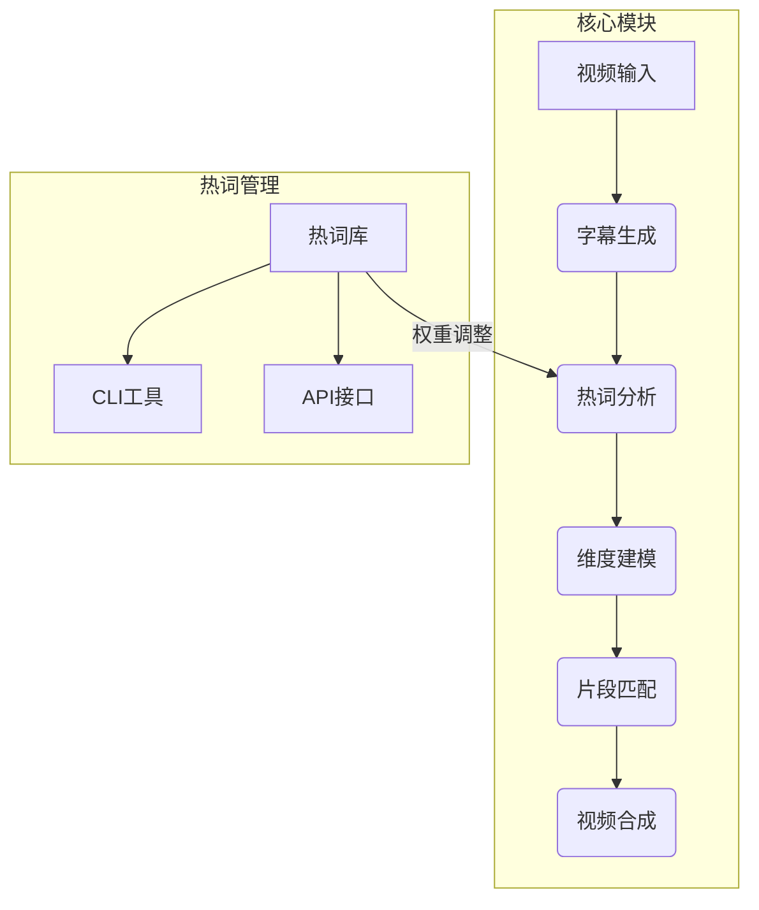
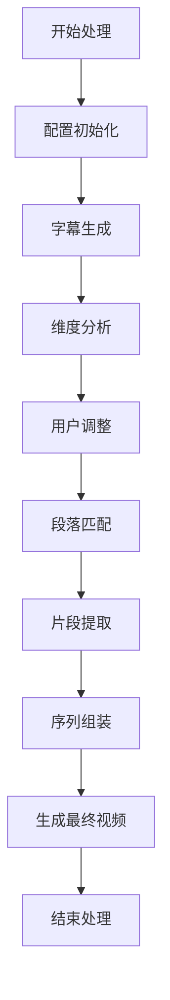
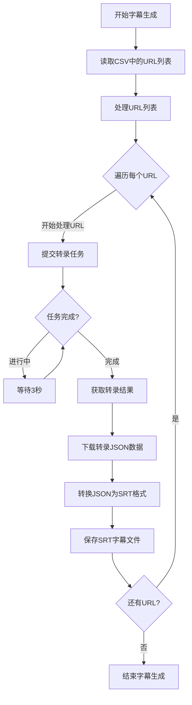
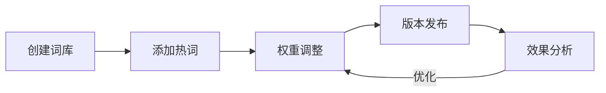

# AI视频分析与合成系统 - 简化版

该系统分析视频片段，提取字幕，进行主题建模，匹配用户需求，并组合成30-40秒的推广视频。

## 系统架构图



## 简化版流程图



## 简化版字幕生成流程



## 主要优化点

1. **移除本地视频处理**：不再需要提取音频等复杂步骤
2. **直接使用DashScope API**：直接从URL提交转录，无需中间处理
3. **简化配置**：直接设置API Key，简化流程
4. **清晰流程**：CSV文件 → 读取URL → 提交转录 → 保存SRT

## 使用方法

1. 准备一个包含视频URL的CSV文件，放在`Input/OSS_VideoList/export_urls.csv`中
2. 在`config.ini`中配置DashScope API Key和热词列表ID
3. 运行系统：

## 热词管理系统

### 核心功能
- 热词增删改查
- 权重动态调整
- 批量导入导出
- 版本控制

### 操作示例
```bash
# 创建热词库
python scripts/wordlist_tools.py create --name "科技热词" --file Input/Wordlists/tech_terms.txt

# 更新热词权重
python scripts/wordlist_tools.py update VID_123 --weight 0.8 --keyword "人工智能"

# 导出热词库
python scripts/wordlist_tools.py export --id vocab-123 --format json

# 智能分析权重
python scripts/wordlist_tools.py auto-weight --strategy semantic_similarity
```

3. 运行主系统：
   ```bash
   python main.py
   ```
   
   或指定步骤：
   ```bash
   python main.py --steps 1-1  # 只执行字幕生成步骤
   ```

## 输出路径

* 字幕文件：`Output/Subtitles/<视频文件名>.srt`
* 最终视频：`Output/Final/advertisement_final.mp4`

## 配置文件管理

### 热词配置
可在`config.ini`中配置DashScope API Key、模型、热词列表ID等：

### 热词生命周期


```ini
[Paraformer]
api_key = sk-xxxxxxxxxxxxxxxxxxxxxxx
default_model = paraformer-v2 
vocabulary_id = vocab-xxxxxxxxx-xxxxxxxxxxxxxxxxxxxxxxxx
```

## 后续处理

生成字幕文件后，系统将进行以下步骤：

1. **维度分析**：分析字幕内容，提取关键词和主题维度
2. **用户调整**：允许用户调整关键词维度和权重
3. **段落匹配**：根据关键词对字幕段落进行评分和匹配
4. **片段提取**：从原始视频中提取得分高的片段
5. **序列组装**：将选中的片段组装成最终推广视频

## 总结

通过优化字幕生成流程，该系统有效简化了从OSS视频URL到SRT字幕文件的转换过程，提高了整个视频分析与合成系统的效率和可靠性。不再需要下载完整视频和音频提取等复杂步骤，直接利用DashScope API完成转录任务。
